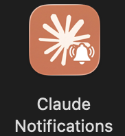
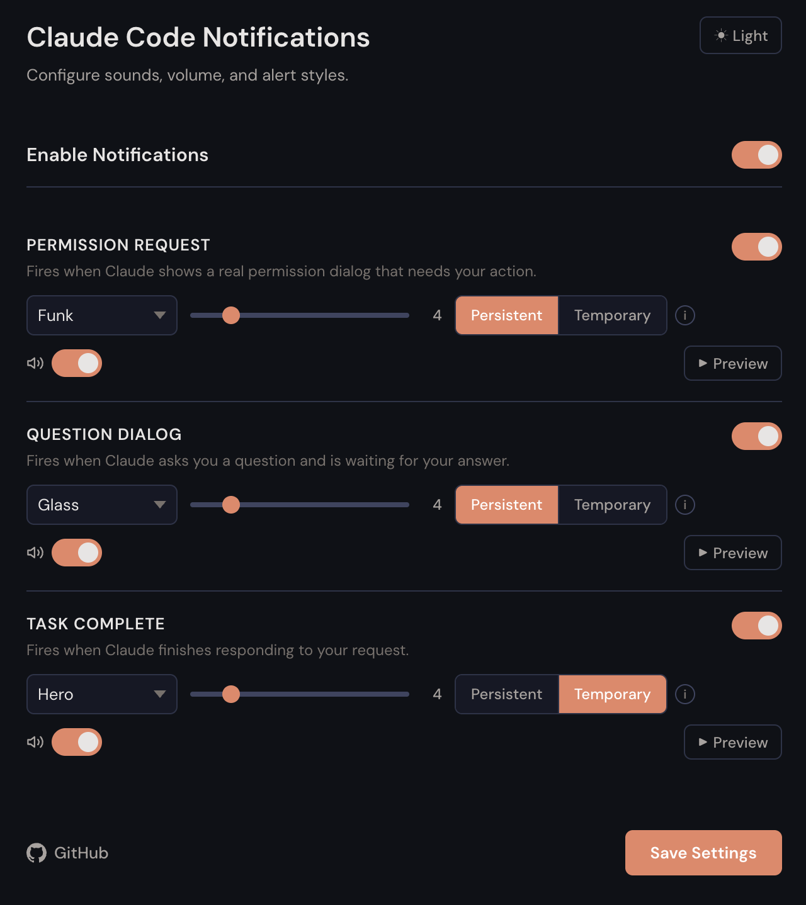

# Claude Code Notifications for macOS

Native macOS notifications when Claude Code needs your attention or finishes a task. Configurable sounds and a browser-based settings UI.

## Why use this

**Works with any terminal** — clicking a notification activates your terminal

**Customizable** — sound, volume, persistent vs temporary style, and enable/disable per event type.

**Browser-based settings UI** — configure everything from a local web page.

**Single-click install** — one script sets up everything.

| Permission request | Question | Done |
|---|---|---|
|  |  |  |

## Install

Download the [latest release](https://github.com/shamrai-nikita/claude-code-notifications/releases/latest) or clone the repo:

```bash
git clone https://github.com/shamrai-nikita/claude-code-notifications.git
cd claude-code-notifications
```

Then run:

```bash
./install.sh
```

After the script finishes, System Settings will open automatically. Enable notifications for **ClaudeNotifications** in System Settings > Notifications.

Then restart any running Claude Code sessions.

## Settings UI

Find **Claude Notifications** in your Applications folder (or Spotlight / Launchpad):



Or launch from the terminal:

```bash
open /Applications/ClaudeNotifications.app
# or: python3 ~/.claude/config-ui.py
```

<details>
<summary>Settings UI preview</summary>



</details>

## Uninstall

```bash
./uninstall.sh
```

Or drag `/Applications/ClaudeNotifications.app` to Trash — cleanup happens automatically on the next Claude Code hook event.

<details>
<summary><strong>Troubleshooting</strong></summary>

**I hear sound but don't see notifications**

Check that notifications for ClaudeNotifications are enabled in System Settings > Notifications.

**Notifications cover each other**

In System Settings > Notifications > ClaudeNotifications, set notification grouping to Off.

**I don't see ClaudeNotifications in the notification apps list**

Try locating it through the Applications section in Finder.

**Notifications disappear after 5 seconds even though I set them to Persistent**

In System Settings > Notifications > ClaudeNotifications, make sure the alert style is set to Alerts (called "Persistent" on macOS 15 and below).

</details>

## Requirements

- macOS 14+
- Claude Code CLI
