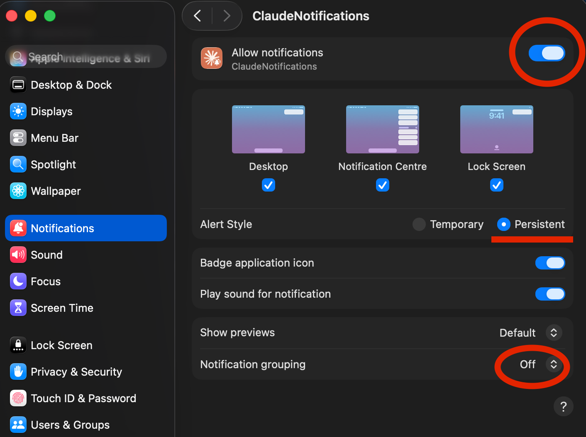
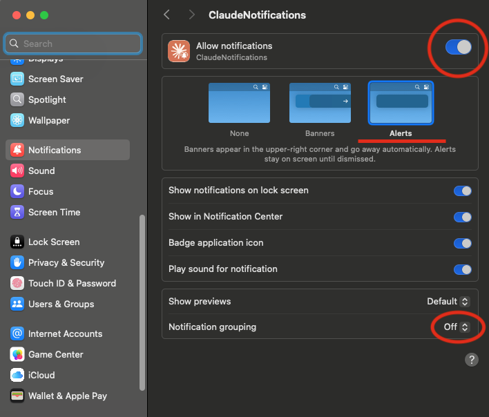

# Claude Code Notifications for macOS

[](LICENSE)
[]()
[](https://github.com/shamrai-nikita/claude-code-notifications/releases/latest)

Native macOS notifications when Claude Code needs your attention or finishes a task. Configurable sounds and a browser-based settings UI.

## Why use this

**Works with any terminal** — clicking a notification activates your terminal

**Customizable** — sound, volume, persistent vs temporary style, notification duration, and enable/disable per event type.

**Browser-based settings UI** — configure everything from a local web page.

**Single-click install** — one script sets up everything.

| Permission request | Question | Done |
|---|---|---|
|  |  |  |

## Install

Download the [latest release](https://github.com/shamrai-nikita/claude-code-notifications/releases/latest) or clone the repo:

```bash
git clone https://github.com/shamrai-nikita/claude-code-notifications.git
cd claude-code-notifications
```

Then run `install.sh` — double-click it in Finder or run from the terminal:

```bash
./install.sh
```

❗ Enable notifications for **ClaudeNotifications** in System Settings > Notifications.

<details>
<summary>macOS 26 and above</summary>



</details>

<details>
<summary>macOS 15 and below</summary>



</details>

✅ Done — you'll start receiving Claude Code notifications.

## Settings UI

Find **Claude Notifications** in your Applications folder (or Spotlight / Launchpad):


Or launch from the terminal:

```bash
open /Applications/ClaudeNotifications.app
# or: python3 ~/.claude/config-ui.py
```


## Uninstall

```bash
./uninstall.sh
```

Or drag `/Applications/ClaudeNotifications.app` to Trash — cleanup happens automatically on the next Claude Code hook event.

## Troubleshooting

<details>
<summary><strong>I hear sound but don't see notifications</strong></summary>

Check that notifications for ClaudeNotifications are enabled in System Settings > Notifications.

</details>

<details>
<summary><strong>Notifications cover each other</strong></summary>

In System Settings > Notifications > ClaudeNotifications, set notification grouping to Off.

</details>

<details>
<summary><strong>I don't see ClaudeNotifications in the notification apps list</strong></summary>

Try locating it through the Applications section in Finder.

</details>

<details>
<summary><strong>Notifications disappear after 5 seconds even though I set them to Persistent</strong></summary>

In System Settings > Notifications > ClaudeNotifications, make sure the alert style is set to Persistent ("Alerts" on macOS 15 and below).

</details>

<details>
<summary><strong>Settings UI not saving settings or throwing an error</strong></summary>

Close the browser tab and open the ClaudeNotifications app again.

</details>

## Requirements

- macOS 14+
- Claude Code CLI
